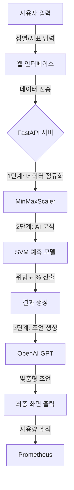

# 🏥 머신러닝 기반 당뇨병 예측 및 AI 건강 상담 시스템 최종 보고서

## 1. 프로젝트 소개
본 프로젝트는 **Pima Indians Diabetes Dataset**을 활용하여 사용자의 건강 지표에 따른 당뇨병 위험도를 예측하고, OpenAI GPT 모델을 통해 개인화된 건강 관리 조언을 제공하는 통합 의료 보조 시스템입니다. 단순한 수치 예측을 넘어 사용자가 자신의 건강 상태를 이해하고 행동 변화를 이끌어낼 수 있는 인터랙티브한 환경을 제공하는 것을 목표로 합니다.

## 2. 주제 관련 배경
- **사회적 배경**: 현대 사회에서 서구화된 식습관과 활동량 감소로 인해 당뇨병 환자가 급증하고 있습니다. 당뇨병은 초기 증상이 뚜렷하지 않아 조기 진단과 지속적인 관리가 필수적입니다.
- **기술적 필요성**: 기존의 자가 진단 방식은 전문 지식이 부족한 일반인이 해석하기 어렵습니다. 머신러닝의 예측 능력과 LLM(대형 언어 모델)의 설명 능력을 결합하여, 누구나 쉽게 이해할 수 있는 의료 보조 도구가 필요합니다.

## 3. 데이터셋 소개
- **데이터셋 명칭**: Pima Indians Diabetes Database (Kaggle 제공)
- **대상**: 21세 이상의 피마 인디언 여성 (의료 분석 표준 데이터셋)
- **특성(Features)**:
    1. Pregnancies: 임신 횟수
    2. Glucose: 공복 혈당 농도
    3. BloodPressure: 이완기 혈압 (mmHg)
    4. SkinThickness: 삼두근 피부 주름 두께 (mm)
    5. Insulin: 혈청 인슐린 (mu U/ml)
    6. BMI: 체질량 지수 (체중/키²)
    7. DiabetesPedigreeFunction: 당뇨 가족력 지수
    8. Age: 나이 (1~99세)
- **타겟(Target)**: Outcome (0: 정상, 1: 당뇨)

## 4. 전처리 과정
- **결측치 처리**: 혈당, 혈압, BMI 등에서 발견된 0값(생리학적으로 불가능한 값)을 결측치로 판단하고, 데이터의 편향을 방지하기 위해 각 항목의 **중앙값(Median)**으로 대체하였습니다.
- **데이터 정규화**: 각 특성의 수치 범위가 상이하므로, 머신러닝 모델의 학습 효율을 높이기 위해 **MinMaxScaler**를 사용하여 모든 값을 0과 1 사이로 변환하였습니다.
- **데이터 분할**: 전체 데이터를 학습용(80%)과 검증용(20%)으로 분리하여 모델의 일반화 성능을 확보하였습니다.

## 5. 모델 구조 및 아키텍처
### 🔹 시스템 흐름도 (System Flowchart)

### 🔹 모델 구조의 쉬운 설명 (비유: 국경 수비대와 상담사)
우리 시스템은 두 명의 전문가가 협력하여 작동한다고 생각하면 쉽습니다.

1. **머신러닝 모델 (SVM) - "꼼꼼한 국경 수비대"**
   - SVM은 수많은 데이터를 분석해 '정상'과 '당뇨' 사이의 **가장 넓고 확실한 경계선**을 긋는 역할을 합니다. 
   - 새로운 사용자가 오면, 이 수비대는 사용자의 건강 지표가 경계선의 어느 쪽에 있는지, 그리고 얼마나 멀리 떨어져 있는지를 보고 **"당신은 정상 쪽에서 멀어지고 있으니 위험도가 70%입니다"**라고 정확히 짚어냅니다.

2. **언어 모델 (GPT) - "친절한 건강 상담사"**
   - 수비대가 숫자(70%)만 알려주면 사용자는 겁을 먹을 수 있습니다. 이때 GPT 상담사가 등판합니다.
   - 상담사는 수비대가 준 결과와 사용자의 나이, 혈당 수치를 보고 **"지금 혈당이 조금 높으니, 오늘부터 설탕이 든 음료 대신 물을 더 많이 마셔보세요"**라고 따뜻하고 알기 쉽게 설명해 줍니다.

### 🔹 기술적 상세
- **알고리즘**: **SVM (Support Vector Machine)**
- **커널**: RBF (Radial Basis Function) 커널을 사용하여 데이터가 복잡하게 섞여 있어도 공간을 비틀어 명확한 경계선을 찾아냅니다.

## 6. 레퍼런스 개선점
- **UI/UX 개선**: 기존의 단순 숫자 입력창을 **슬라이더(Range Slider)**와 **성별 맞춤형 비활성화 로직**으로 변경하여 입력 편의성을 높였습니다.
- **설명력 강화**: 각 지표 옆에 **툴팁(Tooltip)**을 추가하여 전문 의학 용어에 대한 사용자 이해도를 높였습니다.
- **비용 관리**: LLM 연동 시 발생할 수 있는 과금 문제를 방지하기 위해 **Tiktoken 기반 토큰 제한 및 Prometheus 모니터링 시스템**을 구축하였습니다.

## 7. 프로젝트 결과
- **모델 성능**: 최종 테스트 데이터셋 기준 약 **78% 이상의 정확도**를 달성하였으며, 단순 분류가 아닌 확률 기반의 위험도 정보를 제공합니다.
- **시스템 완성도**: 프론트엔드와 백엔드가 통합된 웹 서비스로, 로컬 및 클라우드(Render) 환경에서 모두 안정적으로 구동됩니다.
- **사용자 경험**: "예측 -> 결과 확인 -> AI 상담"으로 이어지는 선형적이고 직관적인 흐름을 완성하였습니다.

## 8. 추후 발전 방향
- **데이터 확장**: 피마 인디언 데이터 외에 한국인 특화 건강 검진 데이터를 추가 학습하여 국내 사용자 맞춤형 모델로 발전시킬 수 있습니다.
- **기기 연동**: 웨어러블 기기(스마트워치 등)의 API와 연동하여 실시간으로 혈당 및 활동량을 수집하고 자동 분석하는 기능을 고려할 수 있습니다.
- **의료진 연결**: AI 분석 결과 위험도가 높을 경우, 인근 병원 예약 시스템이나 전문의 화상 상담으로 연결하는 플랫폼화가 가능합니다.

---
